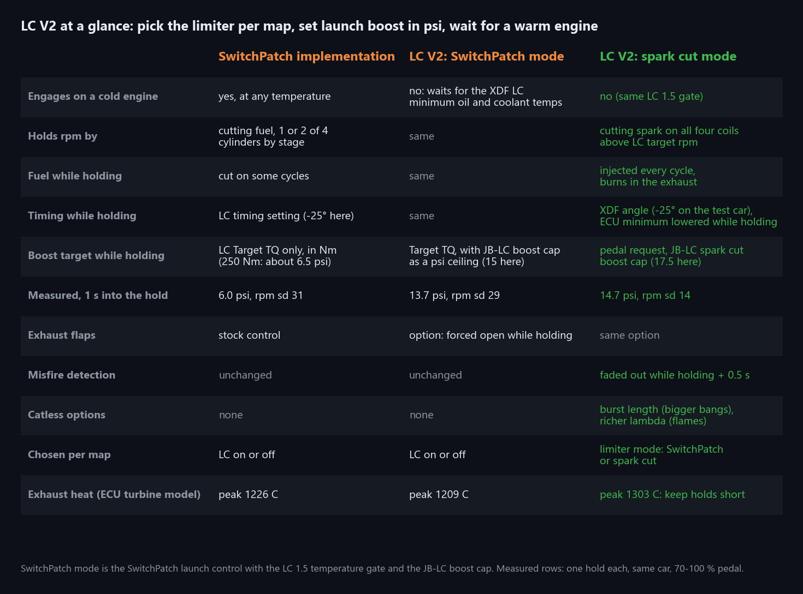
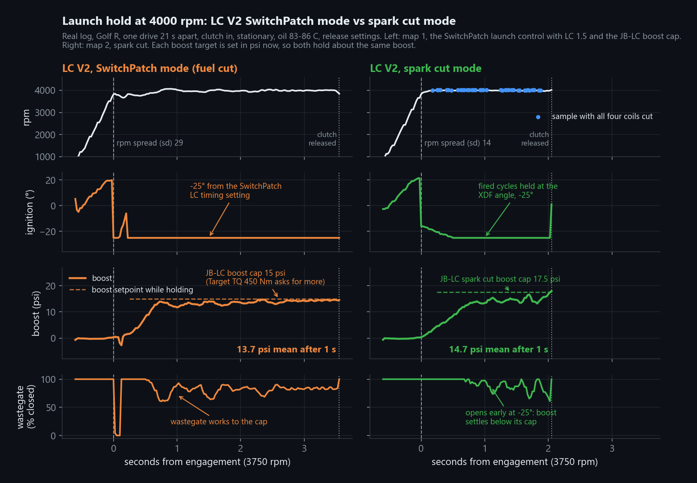
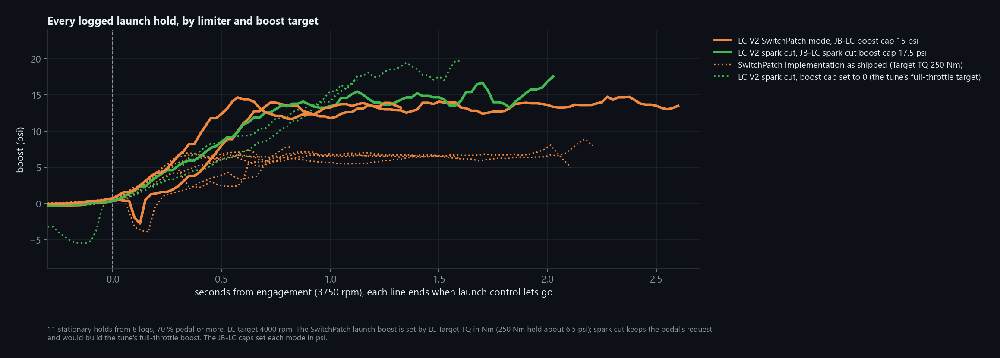
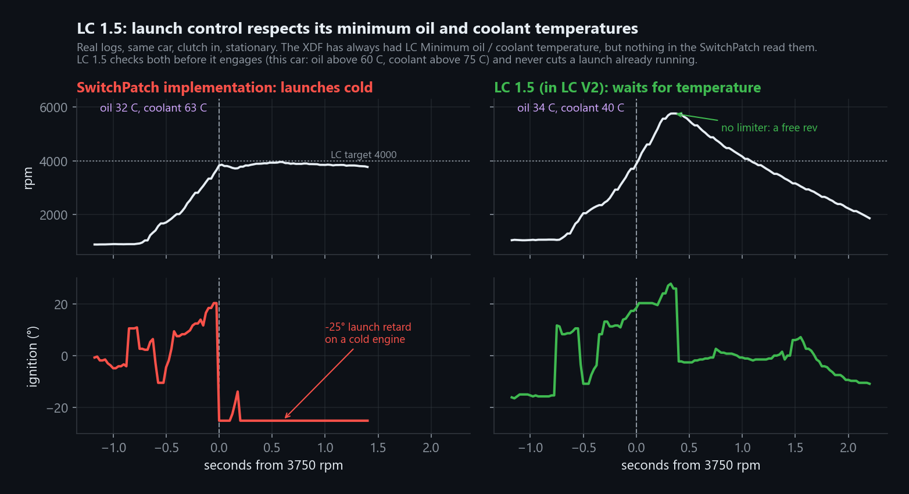
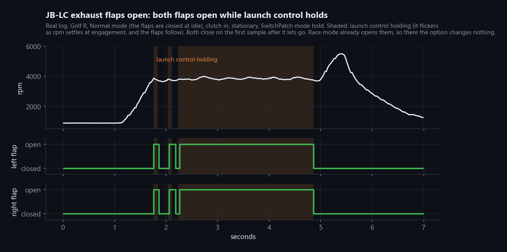

# Launch Control V2 for SwitchPatch 29.33 (Simos18, S50)

> **Spark cut mode is extremely experimental.** It puts unburnt fuel into a hot exhaust on purpose,
> runs very late timing, and switches misfire detection off while it holds. It has been road tested
> on one car for a handful of launches. **If you use spark cut mode, you do so entirely at your own
> risk. I am not responsible for broken engines, turbos, catalytic converters, exhaust parts,
> clutches, gearboxes or anything else.** SwitchPatch mode is the conservative choice.

LC V2 lets each map pick how launch control holds rpm, and sets launch boost in psi:

1. **Limiter mode per map.** SwitchPatch mode is the SwitchPatch launch control (fuel cut, 1 or 2
   of 4 cylinders). Spark cut mode holds rpm by cutting spark on all four coils, ME7 style, with
   fuel still injected.
2. **Launch boost in psi.** A boost cap for each mode, so launch boost stays put when ambient
   pressure, air temperature or timing change.
3. **Warm engine only.** Launch control waits for the XDF's minimum oil and coolant temperatures
   (LC 1.5, included).
4. **Exhaust flaps open** while holding, optional, both modes.
5. **Catless options** for spark cut: longer cut bursts and a richer mixture.

Based on setzi's ME7.x launch control implementation, adapted for Simos18.



**Status: v1.0, road tested** on one car (MK7 Golf R, manual, 8V0906259K, SwitchPatch 29.33 with
push-to-pass, mode memory and RAL V2): map 1 SwitchPatch mode, map 2 spark cut mode, LC target
4000 rpm. SwitchPatch mode: tested, works. Spark cut mode: **experimental**, see the warning above.

## Which mode?

Launch performance is about the same in both modes. You are choosing between gentle and loud.



### SwitchPatch mode

The SwitchPatch launch control, plus the temperature gate, the psi boost cap and the flaps option.

Pros:
- Cooler: the exhaust heat model peaked at 1209 C on the test car, about the same as the
  SwitchPatch implementation.
- No extra fuel in the exhaust. Cut cylinders get no fuel, so nothing burns in the manifold, turbo
  or cat.
- Misfire detection stays fully on.
- Fine with a cat. The sensible daily map.

Cons:
- Looser hold: rpm spread (sd) 29, because it cuts in stages of 1 or 2 injectors.
- Never cuts more than 2 of 4 cylinders, so a very high boost request can push rpm past the target.
- Quieter. That's the point, but it's not the show.

### Spark cut mode (experimental)

Every cylinder still gets fuel. Above the target rpm the coils don't fire, so that fuel goes
into the exhaust and lights there: the machine-gun crackle.

Pros:
- The sound. On a catless car, bigger bangs and flames with the catless options.
- Tightest hold: rpm spread (sd) 14, half of SwitchPatch mode. It checks the real rpm on every
  ignition event and can cut all four coils.
- Clean let-go: all coils and normal timing are back on the next ignition event after the clutch
  comes up.

Cons and risks:
- **Heat.** The exhaust heat model peaked at 1303 C, about 100 C more than SwitchPatch mode. The
  turbine, manifold, O2 sensors, flaps and gaskets all take it.
- **Unburnt fuel in the exhaust.** With a cat or GPF, it burns inside it and can melt or crack it.
- **Oil dilution.** On direct injection, fuel sprayed into a cylinder that doesn't fire washes
  the bore. Long or repeated holds put fuel in the oil.
- **Misfire detection is off** while holding and for a set time afterwards. A real misfire in
  that window is not seen or logged.
- **Pressure spikes** from the bangs load the turbo, wastegate, O2 sensors and mufflers, more so
  with the catless burst option.
- **Very late timing** (-25° on the test car) for as long as you hold.
- **Not road legal** with the catless options, and flames can scorch the bumper or whatever is
  behind the car.

Keep spark cut holds short (2 to 3 s), let the car cool between launches, and don't sit on the
limiter for show.

## Boost

In the SwitchPatch implementation, launch boost comes from **LC Target TQ** (in Nm): more Nm, more
boost. The boost a given Nm asks for moves with ambient pressure, air temperature and timing. LC V2
adds a cap in psi for each mode, so what you set is what you get.



- **SwitchPatch mode:** the cap only trims the Target TQ request. If boost stays under the cap,
  raise Target TQ (test car: 250 Nm held about 6.5 psi, 450 Nm reached the 15 psi cap).
- **Spark cut mode:** keeps your pedal's request, which on its own would build the tune's
  full-throttle boost. The spark cut cap is what stops that. At -25° the wastegate opens early, so
  set the cap a few psi above what you want (test car: a 17.5 cap held about 14.7).

More boost means more heat and more load on the clutch at launch.

## Warm engine only (LC 1.5)

The SwitchPatch XDF has always had LC minimum oil and coolant temperatures, but nothing in the
SwitchPatch reads them. LC V2 does, in both modes. The check runs only when launch control arms,
so a launch that's already holding is never dropped by a reading at the limit.



## Exhaust flaps

With **JB-LC exhaust flaps open** set to 1, both flaps open while launch control holds, in either
mode and in any drive mode. Stock flap control takes over again as soon as launch control lets go.
In race mode the flaps are usually open already, so the option matters in the other drive modes.



## Dependencies

Not standalone. The patch refuses to apply if the bytes it expects are not there.

| Dependency | Why |
|---|---|
| Simos18 **S50** box code (`SC800S50`, 8V0906259K / 5G0906259x family), 4 MB bin | Every address is S50. |
| **`SL PATCH.29.33 - S50`** (switchleg SwitchPatch 29.33) already applied | LC V2 hooks the SwitchPatch launch control, spark modifier, boost and lambda wrappers, and uses its LC settings and RAM. |
| Blank flash at file `0x132FC0..0x13327F` | Where the routines live, after the RAL V2 block. |
| **Full flash** (ASW) after applying | The code is in ASW. Changing the settings afterwards is CAL-only. |
| BinToolz, or stock Python 3 with the `btp_apply.py` in the repo root | To apply, check or remove the `.btp`. |
| TunerPro with `SC8S50_switchpatch29.33_v1.001+JB-patches.xdf` from the repo root | The only way to pick the mode per map and set the caps, angle and options. |

**Not** dependencies: push-to-pass, mode memory and RAL V2. They use separate flash, and the test
car runs all four.

## Applying it

BinToolz: One Click Patch, ADD, pick your bin, pick `JB LC V2 v1.0 - S50.btp`. CHECK and REMOVE
work, the patch carries the original bytes.

Without BinToolz:

```
python ../btp_apply.py add    "JB LC V2 v1.0 - S50.btp" mybin.bin -o mybin_lcv2.bin
python ../btp_apply.py check  "JB LC V2 v1.0 - S50.btp" mybin_lcv2.bin
python ../btp_apply.py remove "JB LC V2 v1.0 - S50.btp" mybin_lcv2.bin -o mybin_back.bin
```

## Settings

All in the repo-root XDF under **LC**. The patch never writes them. The new settings are 0 in stock
29.33: every map in SwitchPatch mode, both caps off and flaps on stock control. A bare install
changes nothing except the temperature gate, so **check your LC minimum oil and coolant
temperatures first.**

| Setting | Address | Modes | Values | Test car |
|---|---|---|---|---|
| JB-LC limiter mode (x5, one per map) | `0x27D813..17` | | 0 = SwitchPatch, 1 = spark cut | map 1: 0, map 2: 1 |
| Enable LC (per map, SwitchPatch) | `0x27D835..39` | both | must be on for either mode | on |
| Target RPM | `0x27CB36` | both | launch rpm | 4000 |
| LC minimum oil / coolant temperature | `0x27CB38` / `39` | both | 0 = no minimum | 60 C / 75 C |
| JB-LC exhaust flaps open | `0x27D818` | both | 1 = forced open while holding, 0 = stock | 1 |
| Target TQ | `0x27CB32` | SwitchPatch | Nm, sets launch boost | 450 Nm |
| Timing during RPM limiter and rampout | `0x27CB31` | SwitchPatch | deg | -25° |
| JB-LC boost cap | `0x27D856` | SwitchPatch | psi above ambient, 0 = off | 15 psi |
| JB-LC spark cut ignition angle | `0x27D81A` | spark cut | deg, the final angle while holding | -25° |
| JB-LC spark cut boost cap | `0x27D872` | spark cut | psi above ambient, 0 = off | 17.5 psi |
| JB-LC spark cut misfire fade-out hold | `0x27D819` | spark cut | ms misfire detection stays off after the hold | 500 ms |
| JB-LC spark cut lambda | `0x27D858` | spark cut, **catless only** | richer lambda while holding, 0 = off | 0 (off) |
| JB-LC spark cut burst length | `0x27D859` | spark cut, **catless only** | coil cuts in a row, 0 or 1 = smooth, 3 to 8 = bigger bangs | 1 |

**Set the spark cut ignition angle before you pick spark cut for a map.** It's 0 in stock 29.33,
which the XDF shows as -35.6°, far later than anything tested.

## Testing it

Log these alongside your usual launch PIDs:

| PID | Address | Expect |
|---|---|---|
| LC SC armed | `0xD000F8D8` (u8) | 1 while spark cut is armed (clutch in, stationary, warm) |
| Ign inhibit mask | `0xD000E56A` (u8) | 15 on the cut samples above target rpm |
| Misfire det faded | `0xD00014C8` (u8) | nonzero while holding and for the fade-out hold after |
| LC SC misfire hold | `0xD000F8D9` (u8) | counts down after the hold |
| LC SC cut | `0xD000F8DC` (u8) | 1 on cut segments |
| Ign Timing Avg | (stock) | at the spark cut angle while holding |
| Exh flap L / R (0 = open) | `0xD0000DC7` / `C8` (u8) | 0 while holding with the flaps option on |

Pass: a cold engine revs freely with no limiter; warm, rpm holds at the target in both modes; boost
settles at or below the cap; no misfire counts during or after a hold.

## Worth knowing

- **SwitchPatch mode bouncing at the limiter?** The SwitchPatch's own **RPM filtering amount**
  (`0x27CB23`) smooths the rpm the limiter reads. At 20 it reacts about 0.2 s late and rpm saws
  around the target. The test car runs 4 (about 0.05 s). It's a SwitchPatch setting, shared with
  the RAL limiter, and not changed by the patch.
- **Spark cut takes about 0.6 s to reach its angle** after it starts retarding (3750 rpm here).
  That's a rate limit further down the ECU, and harmless.
- **Both modes let go when the clutch comes up**, before the car moves. Nothing in LC V2 limits
  torque once the car is rolling.

## What it actually does

Eight hooks, all jumping to routines in blank flash after the SwitchPatch block. The two code
regions map as file = VA - `0x80000000` (region 1) and file = VA - `0x80600000` (region 2).

| Hook (VA) | Where | What |
|---|---|---|
| `0x80132016` | SwitchPatch 10 ms tick | Arming, mode per map, temperature gate, misfire hold. Mode 1 keeps the SwitchPatch LC off. |
| `0x8089AE52` | `CLC_INH_IGC` (per segment) | Spark cut: ORs all four coils into the ignition inhibit mask while armed and above target rpm, with the burst option. |
| `0x808AC31E` | Misfire detection fade-out | Fades misfire detection out while armed and for the hold after. |
| `0x801323D4` | SwitchPatch spark modifier | Forces the final angle to the spark cut angle while retarding. |
| `0x8089B59C` | ECU minimum ignition angle | Lowers the minimum to the same angle so it isn't clamped. |
| `0x80132356` | SwitchPatch boost wrapper | Boost setpoint = min(setpoint, ambient + the cap for the active mode). |
| `0x801324F4` | SwitchPatch lambda wrapper | Spark cut lambda option. |
| `0x808DB71A` | Exhaust flap loop | Flaps option. |

New RAM `0xD000F8D8..F8DD`, unreferenced by the stock code or the SwitchPatch in either region.

Spark cut mode follows setzi's ME7.x launch control (spark cut above the launch rpm, fuel left on),
rebuilt around the Simos18 ignition inhibit mask and the SwitchPatch launch control.

Not affiliated with switchleg, setzi or BinToolz. Provided as is. You are flashing your own ECU, and
**spark cut mode is extremely experimental: use it at your own risk.**
