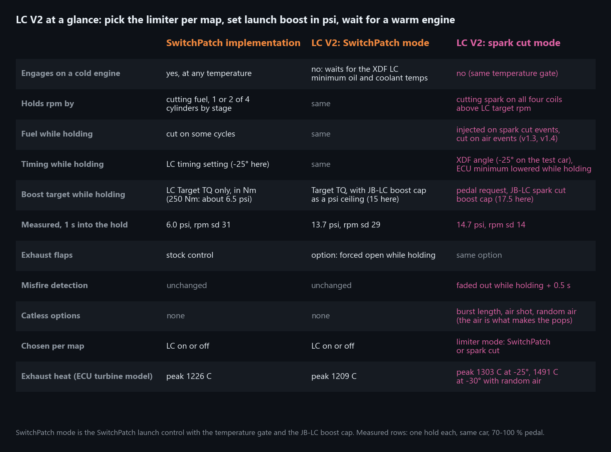
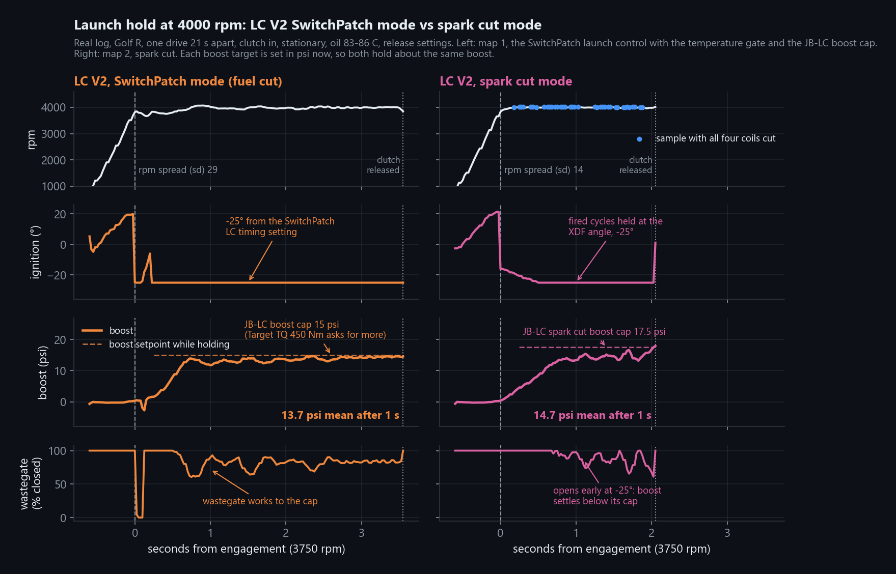
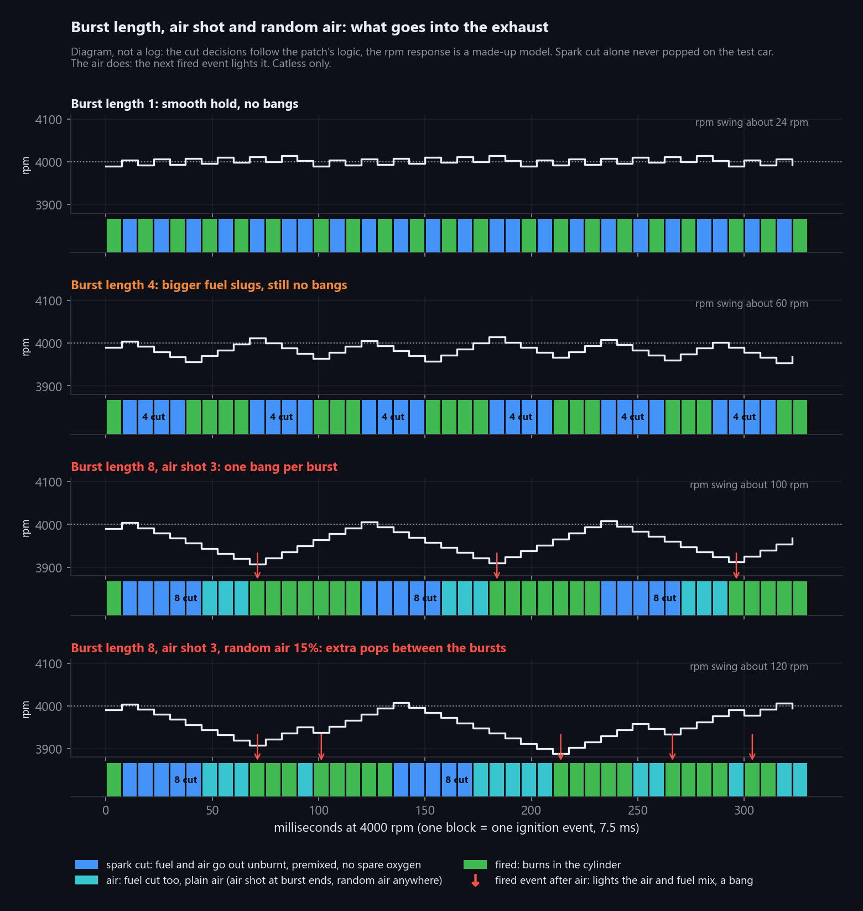
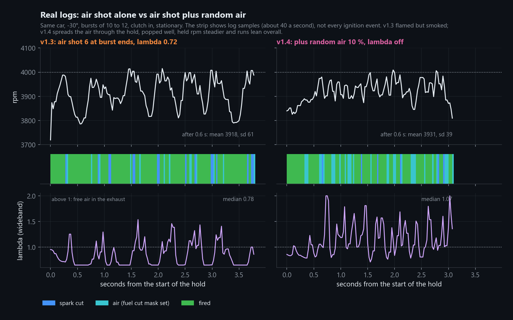

# Launch Control V2 for SwitchPatch 29.33 (Simos18, S50)

> **Spark cut mode is extremely experimental**, road tested on one car. It sends unburnt fuel and
> air into a hot exhaust, runs very late timing and turns misfire detection off while holding.
> **Use it at your own risk; I am not responsible for any damage.** Off-road and closed-course use
> only: follow your local laws.

Each map picks how launch control holds rpm:

- **SwitchPatch mode:** the SwitchPatch launch control (fuel cut). The safest choice, but still not safe:
  any launch loads the clutch, gearbox and turbo. No fuel in the exhaust, so it works with a cat.
- **Spark cut mode:** cuts all four coils, ME7 style. Loud with the air settings, **catless only**.

Both add a launch boost cap in psi, a warm-engine gate (LC minimum oil and coolant temperatures)
and optional exhaust flaps open while holding. Based on setzi's ME7.x launch control.



| Version | Adds | Road tested |
|---|---|---|
| v1.0 | Limiter mode per map, psi boost caps, temperature gate, flaps, spark cut angle and burst length | Yes |
| v1.1 | Random cut patterns | Yes |
| v1.2 | Fuel trim held off at the spark cut limiter | Yes |
| v1.3 | Air shot | Yes: first pops and flames |
| v1.4 | Random air | Yes: pops all through the hold |

New settings at 0 behave exactly like the version before.



## Spark cut: what makes the pops

Spark cut alone never popped on the test car, at any angle, burst length or mixture: the cut charge
has no spare oxygen. **Air** does it. These settings cut fuel as well as spark on some events, so
plain air follows the fuel and the next fired event lights it:

- **Air shot (v1.3):** the last N cut events of each burst. One bang per burst.
- **Random air (v1.4):** a % of events at the limiter, so pops land all through the hold. Keep it
  under the share the hold needs cut (about 50 % at -25°, 20 % at -30°) or rpm sags.





**Risks:** exhaust heat (ECU model up to about 1500 C at -30° with random air), pressure spikes on
the turbo, wastegate, O2 sensors and mufflers, fuel in the oil, no misfire detection while holding,
flames behind the car, which can start a real fire in dry grass, leaves, spilled fuel or anything else
that burns (never hold it near anything flammable; keep an extinguisher at hand). **With a hood exit, side
exit, dump or turndown exhaust the flames come out at the car itself and can set it on fire: do not use spark
cut with one.** With a cat or GPF the fuel burns inside it. Keep holds to 2 or 3 s.

**Ignition angle:** 0 on a SwitchPatch 29.33 bin shows as -35.6°, so **set it first**. -25° is the tested
default; -30° is harsher, sits 50 to 90 rpm under target and **overshoots the boost cap** (up to
about 22 psi on a 17.5 cap). Don't go below -30°.

**Lambda:** leave it off with air. At 0.72 the test car flamed but smoked black.

**[Presets](presets/README.md):** 18 ready-made patterns rated 1 (Mild) to 4 (Extreme). Four
without air are the gentlest spark cut, but **not safe** with a cat:
with a cat, use SwitchPatch mode.

## Applying it

Needs the S50 box code and **`SL PATCH.29.33 - S50`** already applied. Uses blank flash at
`0x132FC0..0x133BBF`.

BinToolz: One Click Patch, ADD, `JB LC V2 v1.4 - S50.btp`, then a **full flash**. After that,
settings changes are CAL only. To upgrade, REMOVE your old LC V2 first; settings stay.

```
python ../btp_apply.py add "JB LC V2 v1.4 - S50.btp" mybin.bin -o mybin_lcv2.bin
```

## Settings

In the repo-root XDF under **LC**. All 0 on a SwitchPatch 29.33 bin (SwitchPatch mode, caps off), so a bare
install only adds the temperature gate: **check your LC minimum oil and coolant temperatures.**

**Setup:** turn it on and set the hold.

| Setting | Address | What it does | Tested with |
|---|---|---|---|
| JB-LC limiter mode (map 1..5) | `0x27D813..17` | How launch control holds rpm on that map. 0 = SwitchPatch mode (fuel cut), 1 = spark cut mode. | map 2: 1 |
| JB-LC exhaust flaps open | `0x27D818` | 1 = both exhaust flaps open while launch control holds, any drive mode. | 1 |
| JB-LC boost cap | `0x27D856` | SwitchPatch mode. Launch boost ceiling in psi above ambient; Target TQ still has to ask for that much. 0 = off. | 15 |
| JB-LC spark cut boost cap | `0x27D872` | Spark cut mode. Launch boost ceiling in psi above ambient. Set a few psi over what you want at -25°; -30° overshoots it. 0 = off. | 17.5 |
| JB-LC spark cut ignition angle | `0x27D81A` | Timing of the fired events while holding. Later = weaker events, more heat and boost. Set it before using spark cut. | -30° |
| JB-LC spark cut misfire fade-out hold | `0x27D819` | How long misfire detection stays off after the hold, in ms. | 500 |

SwitchPatch settings used as before: Enable LC per map (must be on), Target RPM, Target TQ, LC
minimum oil / coolant temperature. `0x27D87F..A5` is reserved: leave it at 0.

**Pops** (spark cut mode): how the cut pattern and the bangs behave. Lambda, the air settings and
anything that groups cuts into bursts are catless only. All 0 = a plain, smooth spark cut limiter. The [presets](presets/README.md) set these for you.

| Setting | Address | What it does | Tested with |
|---|---|---|---|
| JB-LC spark cut lambda | `0x27D858` | Richer mixture while holding (never below 0.72). More flame, but black smoke. 0 = off. | off |
| JB-LC spark cut burst length | `0x27D859` | Events cut in a row once rpm passes target. Longer = bigger fuel slug, rougher hold. 0 or 1 = smooth, up to 62. | 12 |
| JB-LC spark cut burst min (v1.1) | `0x27D876` | Each burst's length is random between this and burst length. 0 = fixed. | 10 |
| JB-LC spark cut cut band (v1.1) | `0x27D877` | rpm window that keeps the hold on target however the cuts are grouped. The other v1.1 settings need it. 60 to 250, 0 = off. | 250 |
| JB-LC spark cut gap min / max (v1.1) | `0x27D878` / `79` | Fired events forced after each burst, random between min and max: a breather between bangs. | 3 / 5 |
| JB-LC spark cut start jitter (v1.1) | `0x27D87A` | Moves burst starts early or late at random for an irregular rhythm, in %. | 0 |
| JB-LC spark cut rpm floor (v1.1) | `0x27D87B` | Ends a burst early if rpm drops this far below target. Limits how rough it gets. | 240 |
| JB-LC spark cut cylinder balance (v1.1) | `0x27D87C` | Lets a burst wait up to 3 events so the bangs spread over all cylinders. Costs steadiness; leave at 0. | 0 |
| JB-LC spark cut air shot (v1.3) | `0x27D87D` | The last N cut events of each burst also cut fuel, so air follows the fuel: one bang per burst. 0 = off. | 6 |
| JB-LC spark cut random air (v1.4) | `0x27D87E` | % of events at the limiter that also cut fuel: pops all through the hold. Keep under about 50 % at -25°, 20 % at -30°. Max 50, 0 = off. | 10 % |

## Worth knowing

- **DSG cars** arm on the brake. The ECU caps a stopped DSG car at **3808 rpm** (`C_N_MAX_DCT`,
  `0x205C3E`): raise it above your Target RPM.
- **SwitchPatch mode bouncing?** Lower the SwitchPatch RPM filtering amount (`0x27CB23`); the test
  car runs 4.
- Both modes let go when the clutch (DSG: brake) comes up.

<details>
<summary>Log PIDs</summary>

| PID | Address | Expect |
|---|---|---|
| LC SC armed | `0xD000F8D8` (u8) | 1 while armed |
| LC SC cut | `0xD000F8DC` (u8) | 1 on cut segments |
| Ign inhibit mask | `0xD000E56A` (u8) | 15 on cut samples |
| Fuel cut mask | `0xD000E69E` (u8) | 15 on air events |
| Misfire det faded | `0xD00014C8` (u8) | nonzero while holding |
| LC SC misfire hold | `0xD000F8D9` (u8) | counts down after the hold |
| LC SC burst len / left | `0xD000F8E2` / `F8DB` (u8) | next burst length / cuts left |
| LC SC gap left | `0xD000F8DD` (u8) | forced fired events left |
| LC SC budget | `0xD000F8E0` (s16) | around 0 with a cut band |
| LC SC bangs | `0xD000F8E6` (u16) | bangs per cylinder, one hex digit each |
| Lambda CL enable | `0xD000145F` (u8) | 0 at the limiter |
| Exh flap L / R | `0xD0000DC7` / `C8` (u8) | 0 (open) while holding |

</details>

<details>
<summary>What it hooks</summary>

File = VA - `0x80000000` (region 1) or VA - `0x80600000` (region 2). RAM `0xD000F8D8..F8E7`.

| Hook (VA) | Where | What |
|---|---|---|
| `0x80132016` | SwitchPatch 10 ms tick | Arming, mode per map, temperature gate |
| `0x8089AE52` | `CLC_INH_IGC` | Spark cut and cut patterns |
| `0x808AC31E` | Misfire fade-out | Misfire detection off while holding |
| `0x801323D4` | SwitchPatch spark modifier | Spark cut angle |
| `0x8089B59C` | ECU minimum ignition angle | Lowered to match |
| `0x80132356` | SwitchPatch boost wrapper | psi caps |
| `0x801324F4` | SwitchPatch lambda wrapper | Spark cut lambda |
| `0x808DB71A` | Exhaust flap loop | Flaps option |
| `0x808C155E` | Lambda control conditions | Open loop at the limiter |
| `0x808A4114` | Fuel cut mask builder call | Air shot and random air |

</details>

Not affiliated with switchleg, setzi or BinToolz. Provided as is.
