# LC V2 cut pattern presets

> **Spark cut mode is extremely experimental, and only Air storm, the Air cannon pattern (at lambda 0.72), 5.56 SAW and Chain gun have run on the test car, in short stationary holds.** They fire unburnt fuel and air into the exhaust on purpose. Everything except the `cat` folder is for catless cars only, and the `cat` folder is **not safe** with a cat either (with a cat, SwitchPatch mode is the least harmful choice): every spark cut pattern sends unburnt fuel into the cat, where it burns and can overheat, melt or crack it. **Fire risk:** flames from the tailpipes can set fire to dry grass, leaves, spilled fuel or oil, or anything else that burns behind or under the car. Never hold it near anything flammable, and keep an extinguisher at hand. **Hood exit, side exit, dump or turndown exhausts:** the flames come out at the car itself, next to wiring, fuel and oil lines, plastics and paint, and can set the car on fire. Do not use spark cut with one. You flash your own ECU at your own risk; the author is not responsible for broken engines, turbos, exhausts, cats or fires.
>
> **For off-road and closed-course use only.** Follow your local laws: removing a catalytic converter, disabling emissions diagnostics and loud exhausts are illegal on road vehicles in many places, and you are responsible for how you use this. Preset and group names (Catless street, Air cannon and so on) are only names for a sound: they do not mean a setting is legal or meant for use on public roads.

Ready-made settings for the LC V2 v1.4 spark cut pattern options, one small patch each. See the [LC V2 README](../README.md) for what the settings do.

## What makes the bangs

On the test car, spark cut alone never popped: not at any ignition angle from +18° to -30°, any burst length up to 24, or any mixture from 0.82 to 0.72. The cut charge carries its own fuel and air and, at lambda 1 or richer, no spare oxygen, so it burned quietly as heat. It popped as soon as air went in: the overrun fuel cut on let-off, then the **air shot** (v1.3: the last few cut events of each burst cut fuel as well, so plain air follows the burst's fuel down the exhaust). The first flames came with bursts of 10-12 at -30° and an air shot of 6 (Air cannon). **Random air** (v1.4) cuts fuel on random events at the limiter to spread the air through the hold. So every catless preset uses one or both; the `cat` presets use neither (air and fuel together burn inside the cat).

## Applying a preset

- Needs **LC V2 v1.4** on the bin. A preset refuses a bin without it.
- **CAL only**: it sets burst length, the seven pattern settings, air shot and random air, nothing else.
- It applies while those ten settings are all 0, as after a fresh install. Burst length 1 counts as a change: set it to 0 first (0 and 1 do the same thing).
- To switch presets, REMOVE the current one, then ADD the next.
- **Lambda and ignition angle are not in the patch.** Each preset lists what it was designed with: set those yourself in TunerPro (`JB-LC spark cut lambda`, `JB-LC spark cut ignition angle`). Lambda is off everywhere except Flamethrower: at 0.72 the test car flamed but smoked black, since the air, not extra fuel, makes the bang. Flamethrower uses 0.72 for the flames; set it off if it smokes.

```
python ../../btp_apply.py add "catless/JB LC V2 v1.4 preset - 2 Moderate - Air crackle.btp" mybin.bin -o mybin_air.bin
```

## Safety rating

The number in each file name, 1 (gentlest) to 4. It ranks the presets by how big and how frequent the bangs are and how rough the hold gets. It is a ranking, not a guarantee: none of them is meant for long holds, and a 1 is only gentle next to the others.

| Rating | What it means |
|---|---|
| 1 Mild | no air, a steady hold. Still not safe with a cat: there, use SwitchPatch mode. |
| 2 Moderate | small pops (about one cylinder of air each), a tight hold. |
| 3 Hard | bigger bangs, a few at flame size, a rougher hold. |
| 4 Extreme | many flame-size bangs, a very rough hold, or -30° with its turbine heat. Seconds, not minutes. |

## Reading the graphics

Each graphic is two seconds of a settled hold at 4000 rpm, on the same scales for every preset. **They are a model, not logs.** The cut decisions follow the patch's own logic exactly; the engine's rpm response is fitted to 35 logged holds on the test car (bursts 1 to 24, angles +18° to -30°); the exhaust model only lets fuel burn where air meets it. Top: rpm, with the target dotted and the rpm floor dashed. Middle: each ignition event, spark cut (blue), air (cyan: fuel cut too) or fired (green). Bottom: the bangs, as the fuel each one burns, in cylinder-fulls; about 3 and up is where flames get likely on a catless car. The numbers above each graphic come from 10 seconds of the same run; fuel left unburnt is relative to the plain limiter (burst length 1, lambda off), after what the bangs burn.

| Preset | Rating | Car | rpm spread | Bangs/s | Average bang | Fuel left unburnt |
|---|---|---|---|---|---|---|
| [Soft stutter](#soft-stutter) | 1 Mild | cat: not safe, use SwitchPatch mode | 16 | 0 | 0.0 | x1.01 |
| [Steady pairs](#steady-pairs) | 1 Mild | cat: not safe, use SwitchPatch mode | 15 | 0 | 0.0 | x1.01 |
| [Stutter](#stutter) | 1 Mild | cat: not safe, use SwitchPatch mode | 14 | 0 | 0.0 | x1.01 |
| [Loose stutter](#loose-stutter) | 1 Mild | cat: not safe, use SwitchPatch mode | 19 | 0 | 0.0 | x1.02 |
| [ME7 crackle](#me7-crackle) | 2 Moderate | catless only | 20 | 9 | 0.9 | x0.80 |
| [Popcorn](#popcorn) | 2 Moderate | catless only | 21 | 13 | 1.0 | x0.67 |
| [Air crackle](#air-crackle) | 2 Moderate | catless only | 22 | 29 | 0.9 | x0.38 |
| [Random crackle](#random-crackle) | 2 Moderate | catless only | 23 | 16 | 1.1 | x0.58 |
| [Chain gun](#chain-gun) | 2 Moderate | catless only | 16 | 37 | 0.9 | x0.21 |
| [Rattle](#rattle) | 2 Moderate | catless only | 21 | 25 | 0.9 | x0.49 |
| [Heavy crackle](#heavy-crackle) | 3 Hard | catless only | 27 | 17 | 1.8 | x0.30 |
| [Rolling thunder](#rolling-thunder) | 3 Hard | catless only | 34 | 18 | 1.9 | x0.18 |
| [5.56 SAW](#556-saw) | 4 Extreme | catless only | 28 | 10 | 3.4 | x0.19 |
| [Chaos](#chaos) | 4 Extreme | catless only | 55 | 18 | 1.5 | x0.34 |
| [Finals](#finals) | 4 Extreme | catless only | 57 | 15 | 1.8 | x0.14 |
| [Flamethrower](#flamethrower) | 4 Extreme | catless only | 35 | 8 | 4.0 | x0.15 |
| [Air cannon](#air-cannon) | 4 Extreme | catless only | 25 | 3 | 4.8 | x0.32 |
| [Air storm](#air-storm) | 4 Extreme | catless only | 32 | 9 | 1.7 | x0.16 |

## Spark cut with a cat (not safe: use SwitchPatch mode)

### Soft stutter

**1 Mild**, not safe with a cat (use SwitchPatch mode). File: `cat/JB LC V2 v1.4 preset - 1 Mild - Soft stutter.btp`

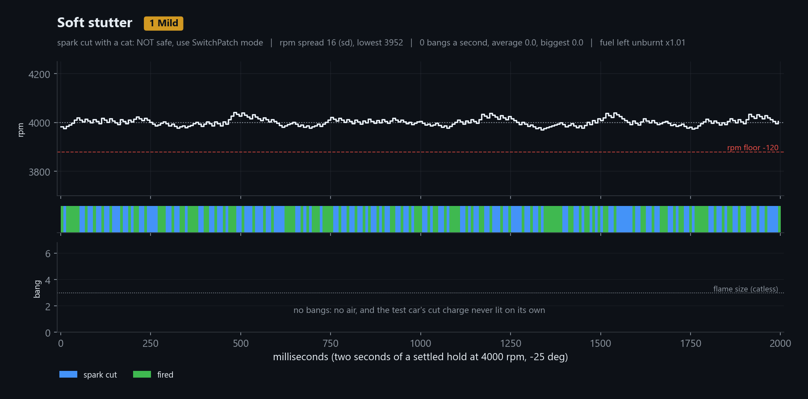

Short bursts and a little jitter, no air: a steady hold. Without air, cars like the test car don't pop on spark cut alone. Not safe with a cat: the cat still burns what it catches. With a cat, use SwitchPatch mode.

| Setting | Value |
|---|---|
| JB-LC spark cut burst length | 2 |
| JB-LC spark cut burst min | 1 |
| JB-LC spark cut cut band | 80 rpm |
| JB-LC spark cut gap min | 0 (off) |
| JB-LC spark cut gap max | 0 (off) |
| JB-LC spark cut start jitter | 20 % |
| JB-LC spark cut rpm floor | 120 rpm |
| JB-LC spark cut cylinder balance | 0 (off) |
| JB-LC spark cut air shot | 0 (off) |
| JB-LC spark cut random air | 0 (off) |
| JB-LC spark cut lambda (set it yourself) | 0 (off) |
| JB-LC spark cut ignition angle (set it yourself) | -25° |

### Steady pairs

**1 Mild**, not safe with a cat (use SwitchPatch mode). File: `cat/JB LC V2 v1.4 preset - 1 Mild - Steady pairs.btp`


Fixed pairs of cuts with one or more fired events between, no air: an even cadence and the steadiest hold of the cat presets. Not safe with a cat: there, use SwitchPatch mode.

| Setting | Value |
|---|---|
| JB-LC spark cut burst length | 2 |
| JB-LC spark cut burst min | 2 |
| JB-LC spark cut cut band | 80 rpm |
| JB-LC spark cut gap min | 1 |
| JB-LC spark cut gap max | 0 (off) |
| JB-LC spark cut start jitter | 0 (off) |
| JB-LC spark cut rpm floor | 120 rpm |
| JB-LC spark cut cylinder balance | 0 (off) |
| JB-LC spark cut air shot | 0 (off) |
| JB-LC spark cut random air | 0 (off) |
| JB-LC spark cut lambda (set it yourself) | 0 (off) |
| JB-LC spark cut ignition angle (set it yourself) | -25° |

### Stutter

**1 Mild**, not safe with a cat (use SwitchPatch mode). File: `cat/JB LC V2 v1.4 preset - 1 Mild - Stutter.btp`

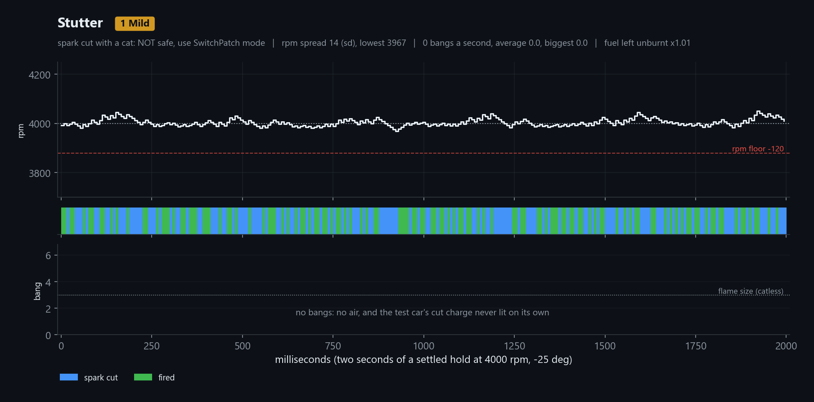

Mostly single cuts, started early or late at random, no air: an uneven stutter. Not safe with a cat: there, use SwitchPatch mode.

| Setting | Value |
|---|---|
| JB-LC spark cut burst length | 1 |
| JB-LC spark cut burst min | 0 (off) |
| JB-LC spark cut cut band | 100 rpm |
| JB-LC spark cut gap min | 0 (off) |
| JB-LC spark cut gap max | 0 (off) |
| JB-LC spark cut start jitter | 60 % |
| JB-LC spark cut rpm floor | 120 rpm |
| JB-LC spark cut cylinder balance | 0 (off) |
| JB-LC spark cut air shot | 0 (off) |
| JB-LC spark cut random air | 0 (off) |
| JB-LC spark cut lambda (set it yourself) | 0 (off) |
| JB-LC spark cut ignition angle (set it yourself) | -25° |

### Loose stutter

**1 Mild**, not safe with a cat (use SwitchPatch mode). File: `cat/JB LC V2 v1.4 preset - 1 Mild - Loose stutter.btp`

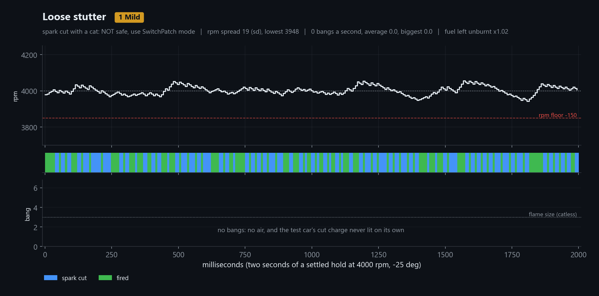

Bursts of 1-2 moved early or late at random, no air: the loosest hold of the cat presets. Not safe with a cat: there, use SwitchPatch mode.

| Setting | Value |
|---|---|
| JB-LC spark cut burst length | 2 |
| JB-LC spark cut burst min | 1 |
| JB-LC spark cut cut band | 100 rpm |
| JB-LC spark cut gap min | 0 (off) |
| JB-LC spark cut gap max | 0 (off) |
| JB-LC spark cut start jitter | 50 % |
| JB-LC spark cut rpm floor | 150 rpm |
| JB-LC spark cut cylinder balance | 0 (off) |
| JB-LC spark cut air shot | 0 (off) |
| JB-LC spark cut random air | 0 (off) |
| JB-LC spark cut lambda (set it yourself) | 0 (off) |
| JB-LC spark cut ignition angle (set it yourself) | -25° |

## Catless only

### ME7 crackle

**2 Moderate**, catless only. File: `catless/JB LC V2 v1.4 preset - 2 Moderate - ME7 crackle.btp`

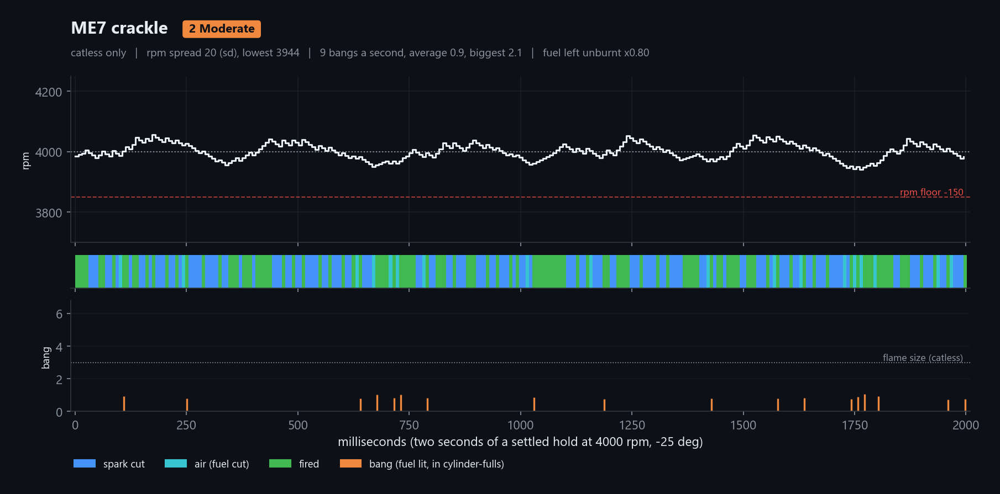

Random bursts of 1-3 with rpm held tight, and 8 % of events at the limiter turned to air at random: the irregular ME7 crackle, small pops. Catless only.

| Setting | Value |
|---|---|
| JB-LC spark cut burst length | 3 |
| JB-LC spark cut burst min | 1 |
| JB-LC spark cut cut band | 100 rpm |
| JB-LC spark cut gap min | 0 (off) |
| JB-LC spark cut gap max | 0 (off) |
| JB-LC spark cut start jitter | 0 (off) |
| JB-LC spark cut rpm floor | 150 rpm |
| JB-LC spark cut cylinder balance | 0 (off) |
| JB-LC spark cut air shot | 0 (off) |
| JB-LC spark cut random air | 8 % |
| JB-LC spark cut lambda (set it yourself) | 0 (off) |
| JB-LC spark cut ignition angle (set it yourself) | -25° |

### Popcorn

**2 Moderate**, catless only. File: `catless/JB LC V2 v1.4 preset - 2 Moderate - Popcorn.btp`

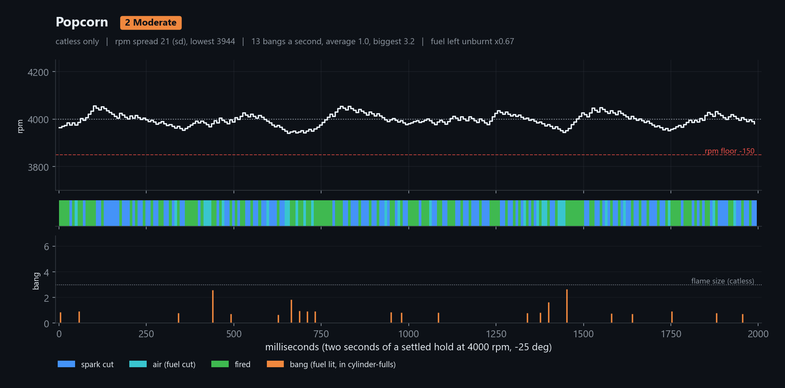

Bursts of 1-2 moved early or late at random, with 12 % random air: lots of small pops at random moments. Busy rather than loud. Catless only.

| Setting | Value |
|---|---|
| JB-LC spark cut burst length | 2 |
| JB-LC spark cut burst min | 1 |
| JB-LC spark cut cut band | 100 rpm |
| JB-LC spark cut gap min | 0 (off) |
| JB-LC spark cut gap max | 0 (off) |
| JB-LC spark cut start jitter | 50 % |
| JB-LC spark cut rpm floor | 150 rpm |
| JB-LC spark cut cylinder balance | 0 (off) |
| JB-LC spark cut air shot | 0 (off) |
| JB-LC spark cut random air | 12 % |
| JB-LC spark cut lambda (set it yourself) | 0 (off) |
| JB-LC spark cut ignition angle (set it yourself) | -25° |

### Air crackle

**2 Moderate**, catless only. File: `catless/JB LC V2 v1.4 preset - 2 Moderate - Air crackle.btp`

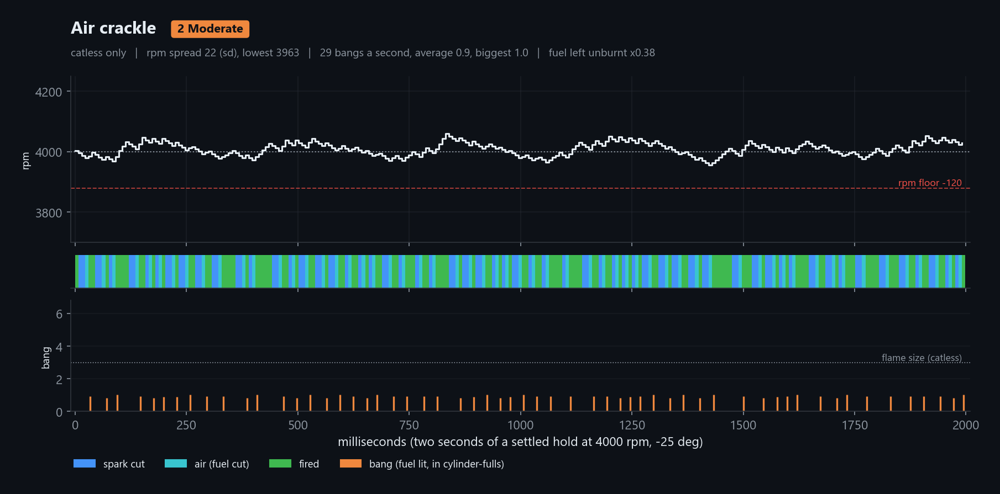

Bursts of 2-3, each ending in one air event: a fast, even crackle of small pops, about 30 a second, with a tight hold. Catless only.

| Setting | Value |
|---|---|
| JB-LC spark cut burst length | 3 |
| JB-LC spark cut burst min | 2 |
| JB-LC spark cut cut band | 150 rpm |
| JB-LC spark cut gap min | 1 |
| JB-LC spark cut gap max | 2 |
| JB-LC spark cut start jitter | 0 (off) |
| JB-LC spark cut rpm floor | 120 rpm |
| JB-LC spark cut cylinder balance | 0 (off) |
| JB-LC spark cut air shot | 1 (last 1 cut events) |
| JB-LC spark cut random air | 0 (off) |
| JB-LC spark cut lambda (set it yourself) | 0 (off) |
| JB-LC spark cut ignition angle (set it yourself) | -25° |

### Random crackle

**2 Moderate**, catless only. File: `catless/JB LC V2 v1.4 preset - 2 Moderate - Random crackle.btp`

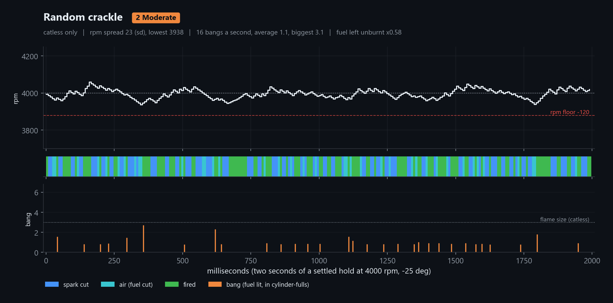

Short bursts with no air shot, and 15 % of events at the limiter cutting fuel at random: air slugs scattered through the hold, an irregular crackle. Catless only.

| Setting | Value |
|---|---|
| JB-LC spark cut burst length | 3 |
| JB-LC spark cut burst min | 2 |
| JB-LC spark cut cut band | 150 rpm |
| JB-LC spark cut gap min | 1 |
| JB-LC spark cut gap max | 2 |
| JB-LC spark cut start jitter | 0 (off) |
| JB-LC spark cut rpm floor | 120 rpm |
| JB-LC spark cut cylinder balance | 0 (off) |
| JB-LC spark cut air shot | 0 (off) |
| JB-LC spark cut random air | 15 % |
| JB-LC spark cut lambda (set it yourself) | 0 (off) |
| JB-LC spark cut ignition angle (set it yourself) | -25° |

### Chain gun

**2 Moderate**, catless only. File: `catless/JB LC V2 v1.4 preset - 2 Moderate - Chain gun.btp`


Fixed pairs on a steady beat, the second of each an air event: a fast, even chain of small pops. The wide cut band keeps the spacing even. Catless only.

| Setting | Value |
|---|---|
| JB-LC spark cut burst length | 2 |
| JB-LC spark cut burst min | 2 |
| JB-LC spark cut cut band | 250 rpm |
| JB-LC spark cut gap min | 1 |
| JB-LC spark cut gap max | 0 (off) |
| JB-LC spark cut start jitter | 0 (off) |
| JB-LC spark cut rpm floor | 150 rpm |
| JB-LC spark cut cylinder balance | 0 (off) |
| JB-LC spark cut air shot | 1 (last 1 cut events) |
| JB-LC spark cut random air | 0 (off) |
| JB-LC spark cut lambda (set it yourself) | 0 (off) |
| JB-LC spark cut ignition angle (set it yourself) | -25° |

### Rattle

**2 Moderate**, catless only. File: `catless/JB LC V2 v1.4 preset - 2 Moderate - Rattle.btp`

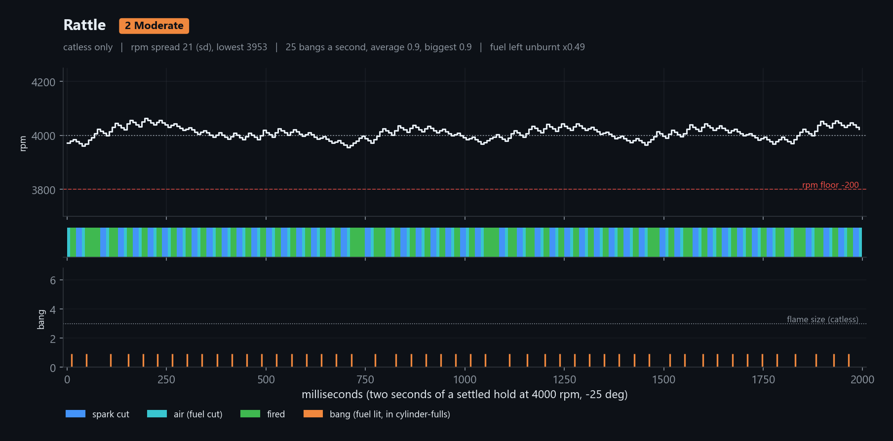

Fixed 3-event bursts with a pause of 2 or more, each ending in an air event: a fast rattle of equal pops, one per burst. Catless only.

| Setting | Value |
|---|---|
| JB-LC spark cut burst length | 3 |
| JB-LC spark cut burst min | 3 |
| JB-LC spark cut cut band | 150 rpm |
| JB-LC spark cut gap min | 2 |
| JB-LC spark cut gap max | 0 (off) |
| JB-LC spark cut start jitter | 0 (off) |
| JB-LC spark cut rpm floor | 200 rpm |
| JB-LC spark cut cylinder balance | 0 (off) |
| JB-LC spark cut air shot | 1 (last 1 cut events) |
| JB-LC spark cut random air | 0 (off) |
| JB-LC spark cut lambda (set it yourself) | 0 (off) |
| JB-LC spark cut ignition angle (set it yourself) | -25° |

### Heavy crackle

**3 Hard**, catless only. File: `catless/JB LC V2 v1.4 preset - 3 Hard - Heavy crackle.btp`

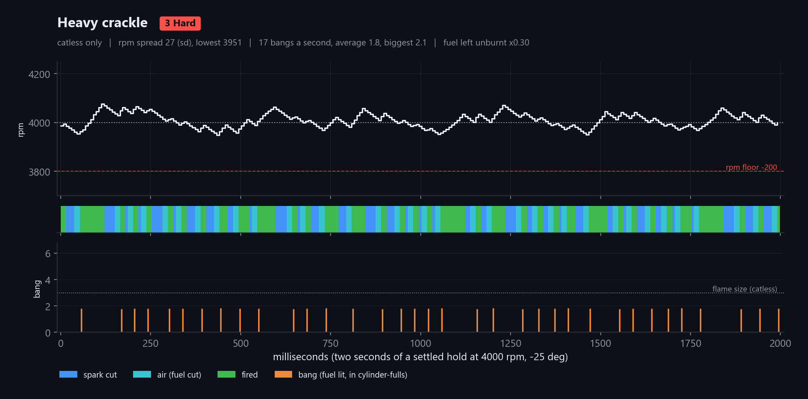

Random bursts of 3-6 with a gap of 2 or more, each ending in two air events: fewer, heavier pops than the crackles, none at flame size. Clearly harder on the exhaust. Catless only.

| Setting | Value |
|---|---|
| JB-LC spark cut burst length | 6 |
| JB-LC spark cut burst min | 3 |
| JB-LC spark cut cut band | 150 rpm |
| JB-LC spark cut gap min | 2 |
| JB-LC spark cut gap max | 0 (off) |
| JB-LC spark cut start jitter | 0 (off) |
| JB-LC spark cut rpm floor | 200 rpm |
| JB-LC spark cut cylinder balance | 0 (off) |
| JB-LC spark cut air shot | 2 (last 2 cut events) |
| JB-LC spark cut random air | 0 (off) |
| JB-LC spark cut lambda (set it yourself) | 0 (off) |
| JB-LC spark cut ignition angle (set it yourself) | -25° |

### Rolling thunder

**3 Hard**, catless only. File: `catless/JB LC V2 v1.4 preset - 3 Hard - Rolling thunder.btp`

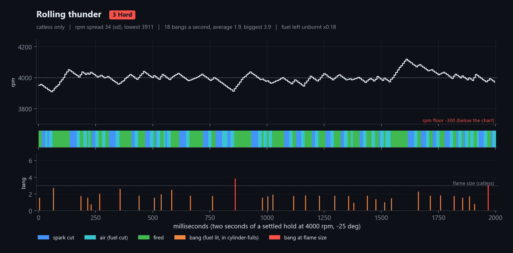

Bursts of 2-6 at uneven spacing ending in two air events, plus 5 % random air: big and medium bangs mixed, rumble with the odd crack. A rough hold. Catless only.

| Setting | Value |
|---|---|
| JB-LC spark cut burst length | 6 |
| JB-LC spark cut burst min | 2 |
| JB-LC spark cut cut band | 200 rpm |
| JB-LC spark cut gap min | 1 |
| JB-LC spark cut gap max | 3 |
| JB-LC spark cut start jitter | 50 % |
| JB-LC spark cut rpm floor | 300 rpm |
| JB-LC spark cut cylinder balance | 0 (off) |
| JB-LC spark cut air shot | 2 (last 2 cut events) |
| JB-LC spark cut random air | 5 % |
| JB-LC spark cut lambda (set it yourself) | 0 (off) |
| JB-LC spark cut ignition angle (set it yourself) | -25° |

### 5.56 SAW

**4 Extreme**, catless only. File: `catless/JB LC V2 v1.4 preset - 4 Extreme - 5.56 SAW.btp`

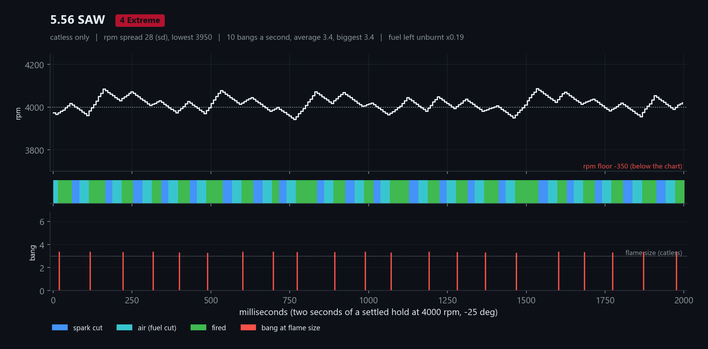

Bursts of 7-8 with breaks of 3-5, each ending in four air events: about ten flame-size booms a second in the model. On the test car (-25°, lambda off) it ran about 14 cracks a second, even in size, with short flames at the tips: smaller bangs than the model, more of them. A heavy pressure spike on the turbo, wastegate and mufflers every time. Catless only.

| Setting | Value |
|---|---|
| JB-LC spark cut burst length | 8 |
| JB-LC spark cut burst min | 7 |
| JB-LC spark cut cut band | 250 rpm |
| JB-LC spark cut gap min | 3 |
| JB-LC spark cut gap max | 5 |
| JB-LC spark cut start jitter | 0 (off) |
| JB-LC spark cut rpm floor | 350 rpm |
| JB-LC spark cut cylinder balance | 0 (off) |
| JB-LC spark cut air shot | 4 (last 4 cut events) |
| JB-LC spark cut random air | 0 (off) |
| JB-LC spark cut lambda (set it yourself) | 0 (off) |
| JB-LC spark cut ignition angle (set it yourself) | -25° |

### Chaos

**4 Extreme**, catless only. File: `catless/JB LC V2 v1.4 preset - 4 Extreme - Chaos.btp`

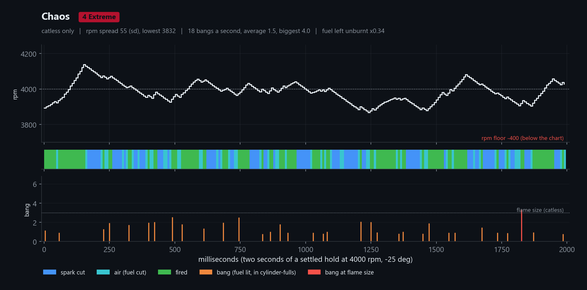

Two-step competition preset: bursts of 1-8 started early or late at random, one air event each, and 15 % random air. rpm swings hard. Seconds only, rough on hardware. Catless only.

| Setting | Value |
|---|---|
| JB-LC spark cut burst length | 8 |
| JB-LC spark cut burst min | 1 |
| JB-LC spark cut cut band | 250 rpm |
| JB-LC spark cut gap min | 0 (off) |
| JB-LC spark cut gap max | 2 |
| JB-LC spark cut start jitter | 100 % |
| JB-LC spark cut rpm floor | 400 rpm |
| JB-LC spark cut cylinder balance | 0 (off) |
| JB-LC spark cut air shot | 1 (last 1 cut events) |
| JB-LC spark cut random air | 15 % |
| JB-LC spark cut lambda (set it yourself) | 0 (off) |
| JB-LC spark cut ignition angle (set it yourself) | -25° |

### Finals

**4 Extreme**, catless only. File: `catless/JB LC V2 v1.4 preset - 4 Extreme - Finals.btp`

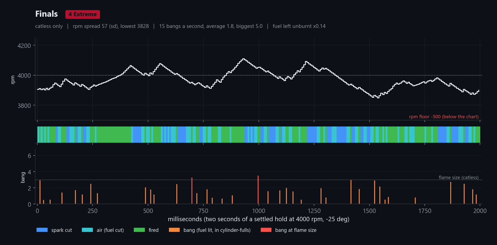

Everything at the limit: the widest random mix, two air events a burst and 20 % random air. The most air, bangs and heat of the -25° presets. Seconds, not minutes. Catless only.

| Setting | Value |
|---|---|
| JB-LC spark cut burst length | 8 |
| JB-LC spark cut burst min | 1 |
| JB-LC spark cut cut band | 250 rpm |
| JB-LC spark cut gap min | 0 (off) |
| JB-LC spark cut gap max | 2 |
| JB-LC spark cut start jitter | 100 % |
| JB-LC spark cut rpm floor | 500 rpm |
| JB-LC spark cut cylinder balance | 0 (off) |
| JB-LC spark cut air shot | 2 (last 2 cut events) |
| JB-LC spark cut random air | 20 % |
| JB-LC spark cut lambda (set it yourself) | 0 (off) |
| JB-LC spark cut ignition angle (set it yourself) | -25° |

### Flamethrower

**4 Extreme**, catless only. File: `catless/JB LC V2 v1.4 preset - 4 Extreme - Flamethrower.btp`

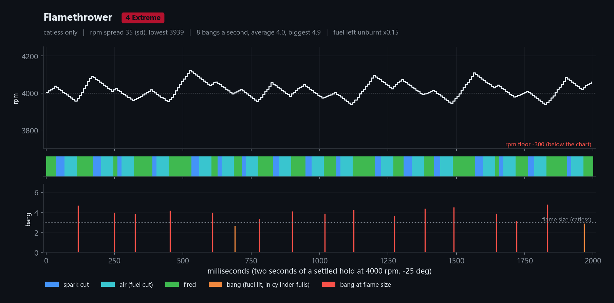

Built for flames: bursts of 8-10 at -25° ending in six air events, with lambda 0.72, so each burst is a big fuel slug with a big air slug behind it. About eight flame-size bangs a second, more than Air cannon, and less fuel left unburnt. Lambda 0.72 is what makes the flames: set it off if it smokes black (fewer flames, about five a second). Catless only, seconds only.

| Setting | Value |
|---|---|
| JB-LC spark cut burst length | 10 |
| JB-LC spark cut burst min | 8 |
| JB-LC spark cut cut band | 250 rpm |
| JB-LC spark cut gap min | 2 |
| JB-LC spark cut gap max | 4 |
| JB-LC spark cut start jitter | 0 (off) |
| JB-LC spark cut rpm floor | 300 rpm |
| JB-LC spark cut cylinder balance | 0 (off) |
| JB-LC spark cut air shot | 6 (last 6 cut events) |
| JB-LC spark cut random air | 0 (off) |
| JB-LC spark cut lambda (set it yourself) | 0.72 |
| JB-LC spark cut ignition angle (set it yourself) | -25° |

### Air cannon

**4 Extreme**, catless only. File: `catless/JB LC V2 v1.4 preset - 4 Extreme - Air cannon.btp`

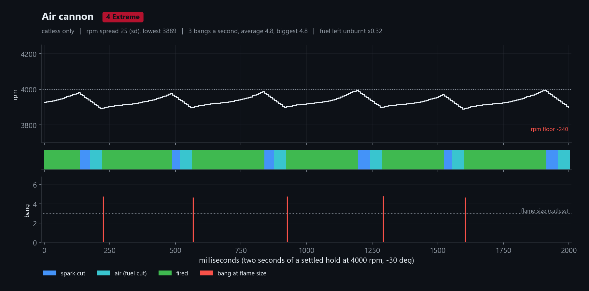

The test car's first flames: bursts of 10-12 at -30° ending in six air events. A few huge bangs a second, turbine near 2450 °F, boost overshooting its cap. At -30° the hold sits 50-90 rpm under target. Catless only, seconds only.

| Setting | Value |
|---|---|
| JB-LC spark cut burst length | 12 |
| JB-LC spark cut burst min | 10 |
| JB-LC spark cut cut band | 250 rpm |
| JB-LC spark cut gap min | 3 |
| JB-LC spark cut gap max | 5 |
| JB-LC spark cut start jitter | 0 (off) |
| JB-LC spark cut rpm floor | 240 rpm |
| JB-LC spark cut cylinder balance | 0 (off) |
| JB-LC spark cut air shot | 6 (last 6 cut events) |
| JB-LC spark cut random air | 0 (off) |
| JB-LC spark cut lambda (set it yourself) | 0 (off) |
| JB-LC spark cut ignition angle (set it yourself) | -30° |

### Air storm

**4 Extreme**, catless only. File: `catless/JB LC V2 v1.4 preset - 4 Extreme - Air storm.btp`

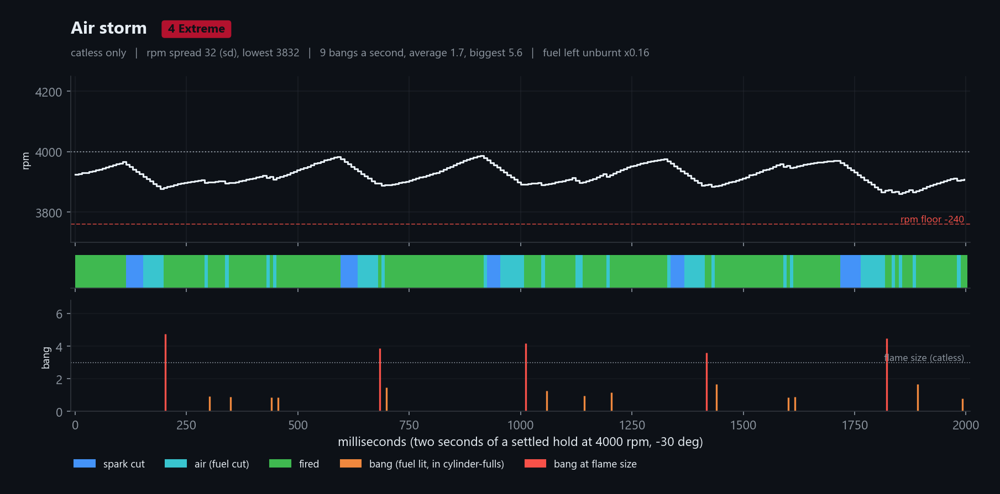

Air cannon plus 10 % random air: the burst-end bangs with smaller pops between them, and less unburnt fuel. The -30° hold only needs about a quarter of events cut, so keep random air under about 20 % there. Catless only, seconds only.

| Setting | Value |
|---|---|
| JB-LC spark cut burst length | 12 |
| JB-LC spark cut burst min | 10 |
| JB-LC spark cut cut band | 250 rpm |
| JB-LC spark cut gap min | 3 |
| JB-LC spark cut gap max | 5 |
| JB-LC spark cut start jitter | 0 (off) |
| JB-LC spark cut rpm floor | 240 rpm |
| JB-LC spark cut cylinder balance | 0 (off) |
| JB-LC spark cut air shot | 6 (last 6 cut events) |
| JB-LC spark cut random air | 10 % |
| JB-LC spark cut lambda (set it yourself) | 0 (off) |
| JB-LC spark cut ignition angle (set it yourself) | -30° |

---

Experimental. Only Air storm, the Air cannon pattern (at lambda 0.72), 5.56 SAW and Chain gun have run on the test car. Not responsible for broken engines or fires.
