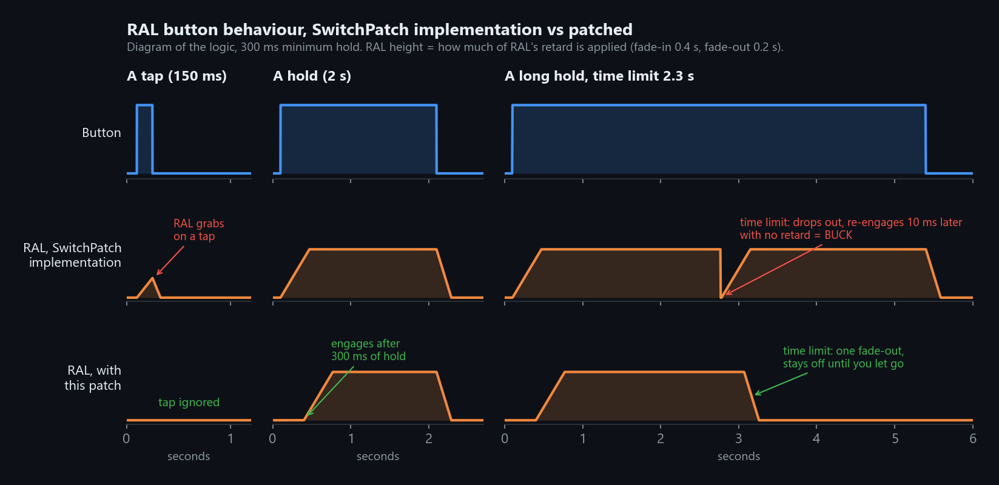
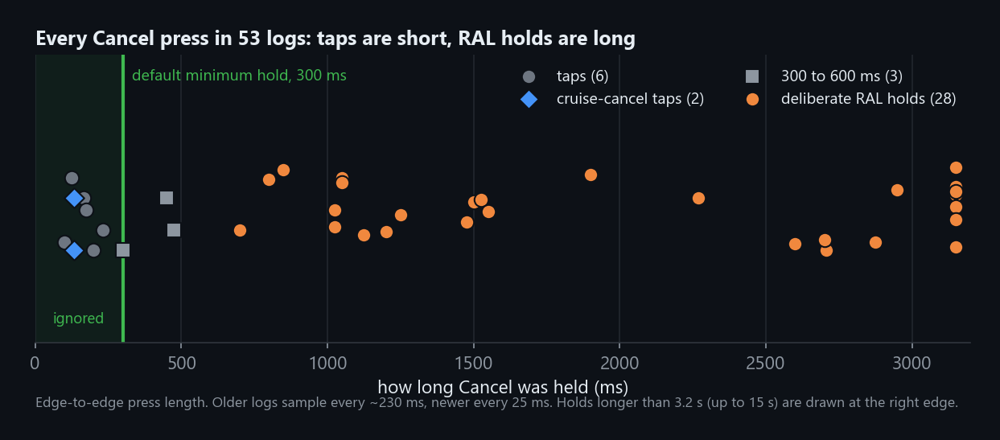
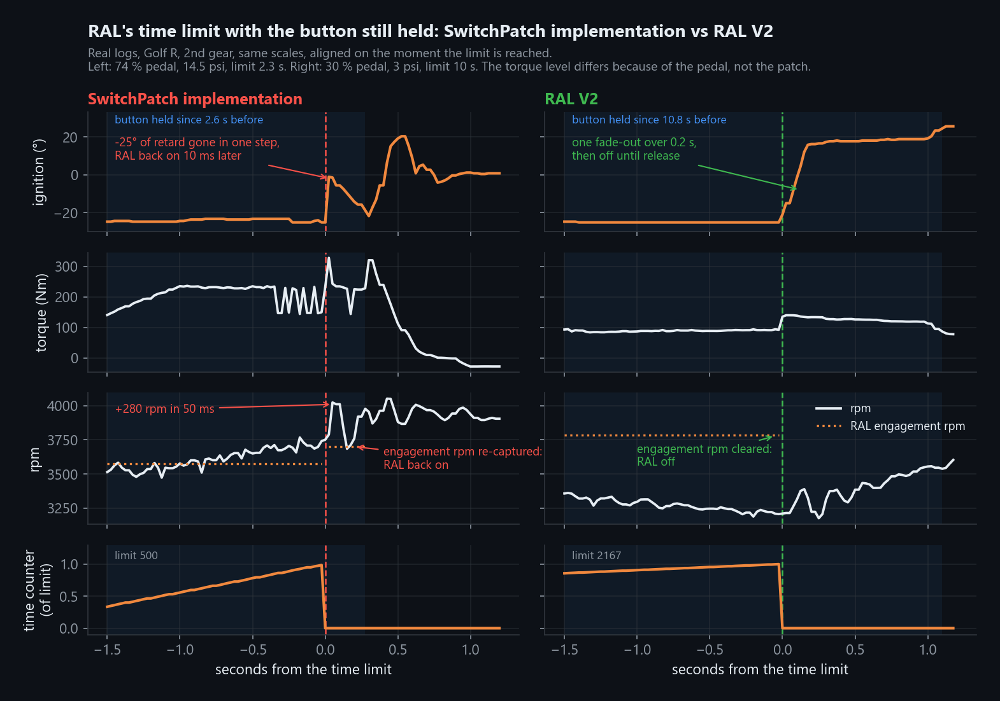
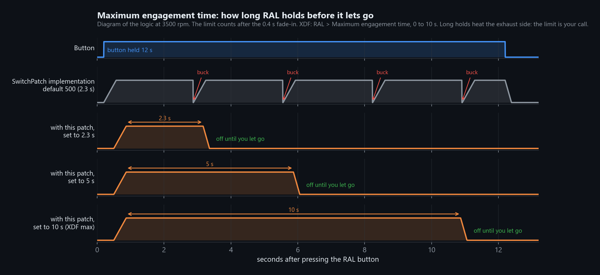
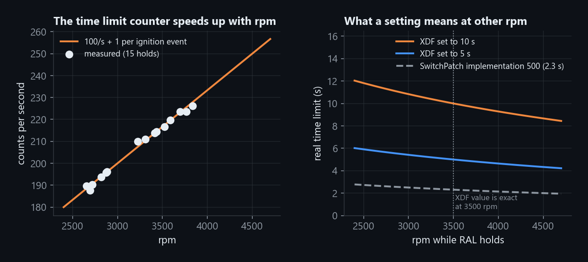
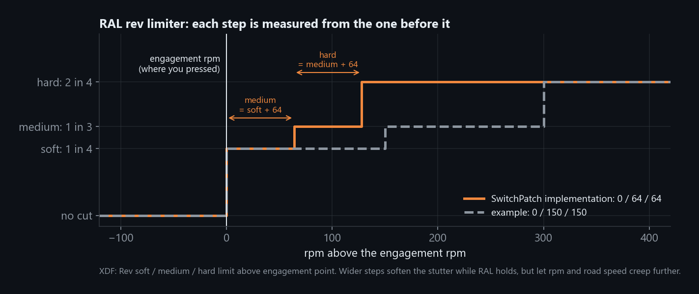

# Rolling Anti-Lag V2 for SwitchPatch 29.33 (Simos18, S50)

Three changes to the switchpatch's rolling anti-lag (RAL):

1. **Minimum hold.** RAL only engages once the button has been held longer than a tap, so
   cancelling cruise or brushing the button no longer grabs RAL.
2. **Cancel as a RAL button.** Stock 29.33 offers Set or Resume; V2 adds Cancel as a third choice.
3. **No buck at the time limit.** Stock RAL drops out at its time limit and re-engages 10 ms later
   with no retard if the button is still held. V2 fades out once and stays off until you let go.



**Status: v1.0, road tested** on one car (MK7 Golf R, 8V0906259K, SwitchPatch 29.33 with
push-to-pass v1.1 and mode memory v1.0), Cancel as the button, 300 ms hold.

## Dependencies

Not standalone. The patch checks the first three by refusing to apply if the bytes it expects
are not there.

| Dependency | Why |
|---|---|
| Simos18 **S50** box code (`SC800S50`, 8V0906259K / 5G0906259x family), 4 MB bin | Every address is S50. |
| **`SL PATCH.29.33 - S50`** (switchleg SwitchPatch 29.33) already applied | The patch hooks the switchpatch button tick at file `0x131FEE`, filters the RAL button state the tick already reads, and uses the switchpatch's RAL settings and RAM. Other switchpatch versions lay this out differently. |
| Blank flash at file `0x132F40..0x132FA3` (100 bytes) | Where the routine lives, right after the mode memory block. If anything else is there, the patch refuses to apply rather than overwrite it. |
| **Full flash** (ASW) after applying | The code is in ASW1, a CAL-only flash will not carry it. Changing the settings afterwards is CAL-only. |
| BinToolz, or stock Python 3 with the `btp_apply.py` in the repo root | To apply, check or remove the `.btp`. |
| TunerPro with `SC8S50_switchpatch29.33_v1.001+JB-patches.xdf` from the repo root | The only way to pick Cancel, set the hold and set the time limit in seconds. Without it, the only change you get is the clean time-limit ending. |

**Not** dependencies: push-to-pass and mode memory. RAL V2 applies to a plain switchpatch 29.33
bin, and with both of the others all six install orders give the same bin.

## Applying it

BinToolz: One Click Patch, ADD, pick your bin, pick `JB RAL V2 v1.0 - S50.btp`. CHECK and REMOVE
work, the patch carries the original bytes.

Without BinToolz:

```
python ../btp_apply.py add    "JB RAL V2 v1.0 - S50.btp" mybin.bin -o mybin_ralv2.bin
python ../btp_apply.py check  "JB RAL V2 v1.0 - S50.btp" mybin_ralv2.bin
python ../btp_apply.py remove "JB RAL V2 v1.0 - S50.btp" mybin_ralv2.bin -o mybin_back.bin
```

**If you hand-edited the switchpatch to put RAL on Cancel** (the button selector at file
`0x131E6A` changed from `E1` to `DF`, so 0 = Cancel): put `E1` back first. RAL V2 does not touch
that byte, so it installs fine over the edit and 0 keeps meaning Cancel.

## Settings

All in the repo-root XDF under **RAL**. The patch never writes them. Both new bytes are 0 in stock
29.33, and 0 means stock behaviour, so a bare install changes nothing except the time-limit
ending until you set them.

| Setting | Address | Values | Test car |
|---|---|---|---|
| RAL engagement button | `0x27CB26` | 0 = Set, 1 = Resume (stock), **2 = Cancel** (new) | 2 |
| RAL minimum hold (new) | `0x27D81B` | 0 to 2540 ms in 10 ms steps, 0 = engage on press | 300 ms |
| Maximum engagement time | `0x27CB16` | 0 to 10 s (stock 29.33 value 500 shows as 2.3 s) | 10 s |
| Rev soft / medium / hard limit | `0x27CB18` / `1A` / `1C` | rpm, each step measured from the one before | stock 0 / 64 / 64 |

Removing the patch with the button byte left at 2 gives Set: the stock selector treats anything
but 1 as Set.

## The minimum hold

Stock RAL engages on the first 10 ms tick the button is down. A tap engages it and drops it
straight away, which shows in the logs as an rpm dip and bounce during a quick tap.



Across 53 logs every tap was under 250 ms (longest 231 ms), and every deliberate RAL hold was
700 ms or longer. 300 ms clears every tap and costs RAL nothing: on every deliberate hold, boost
was still at or below about 2 psi 300 ms after the press, because the pedal had not arrived yet.

Tuning: 500 ms if taps still get through (three presses between 300 and 600 ms were ambiguous),
200 ms if RAL feels late. The hold applies to whichever button is selected.

## Cancel as the button

Cancel still cancels cruise instantly, that is the cruise control, not this code. With the hold
in place, a cruise-cancel tap no longer reaches RAL. Resume is also the map select button on many
setups (Map Switching > UI button, `0x27CB28` = 1). Choosing Resume for both is your call, same
as stock. This is left for people who use pedal presses to enter the map select.

## The time-limit fix

When RAL reaches **Maximum engagement time**, the switchpatch ends it. But nothing remembers why
it ended, so with the button still down it re-engages on the next 10 ms tick. The fade-in restarts
from 0 %, so the full -25° of retard disappears in one step, and the engagement rpm is captured
again, higher. That is a hard buck. The two sides below are real logs from the same car, aligned
on the moment the limit is reached:



With V2, RAL ends once with its normal 0.2 s fade-out, the same as letting go of the button, and
stays off until you release. A press that never got RAL active (rpm outside the window, for
example) keeps retrying every tick, as stock does. Held past the limit, stock bucks every time the
limit comes round again:



## The time limit in seconds

The stock XDF shows **Maximum engagement cycles** as a raw count. The counter it compares against
starts after the 0.4 s fade-in and runs at 100 per second plus 1 per ignition event (rpm / 30),
so its speed depends on rpm. The repo-root XDF shows it in seconds, exact at 3500 rpm: about 15 %
longer at 2500 rpm, 10 % shorter at 4500 rpm. The stock value 500 is 2.3 s at 3500 rpm.



The XDF caps it at 10 s. Long holds put a lot of heat into the exhaust side, so the limit is your
call.

## Rev limiter steps

Not changed by the patch, only explained better in the XDF. Only the soft limit is measured from
the engagement rpm; medium and hard are each measured from the step before. The stock
0 / 64 / 64 cuts at +0, +64 and +128 rpm.



64 rpm steps make the hold stutter: in one log, torque swung between 440 and 170 Nm while RAL held
road speed. Wider steps such as 0 / 150 / 150 soften that, but let rpm and road speed creep further.

## Testing it

Log these alongside your usual RAL PIDs:

| PID | Address | Expect |
|---|---|---|
| RAL hold count | `0xD000F805` (u8) | 0 released, counts up to the hold while waiting, hold + 1 once RAL is active |
| Active (RAL) | `0xD000F878` (u8) | 1 while RAL runs |
| Counter (RAL) | `0xD000F872` (u16) | climbs to Maximum engagement time, then 0 |

Pass: a tap does nothing; a hold engages RAL after the hold time; a hold past the time limit
gives one fade-out and RAL stays off until release.

## Worth knowing

- **Button first, then pedal.** The switchpatch refuses to engage RAL while rpm is still climbing
  (Maximum acceleration allowed to enable RAL, `0x27CB22`) and checks every tick until it engages.
  With the hold, that check starts 300 ms later. Floor it at the same moment you press, and the
  car can already be accelerating by then, so RAL waits. Every late or missed engagement in the
  road test was a switchpatch gate like this (rpm climbing, oil below the minimum oil temperature
  in `0x27CB24`, RAL disabled on the map), not the hold.
- **Set during RAL** (stock already uses it to end RAL) now also keeps RAL off until you release
  the RAL button.
- **Longest hold is 2540 ms**, one byte in 10 ms steps.
- **The hold counter is borrowed RAM.** `0xD000F805` is the switchpatch's map-down press counter,
  which it only uses while a map-switch gesture is open. RAL V2 only uses it while none is open.

## What it actually does

One 4-byte hook at file `0x131FEE` in the switchpatch button tick jumps to a 100-byte routine at
`0x132F40`, which filters the RAL button state before the RAL block sees it:

- button up: count cleared;
- button down, count below the hold: count + 1, RAL does not see the press;
- count at the hold: the press passes. Once RAL is active the count latches at hold + 1. If RAL
  then ends while latched (the time limit), the press is masked until release.

For button 2 the routine loads Cancel in place of what the stock selector loaded, so the selector
itself stays byte-stock. No new RAM. One new CAL byte (the hold) and one new value for an existing one (button 2).

Not affiliated with switchleg or BinToolz. Provided as is. You are flashing your own ECU.
